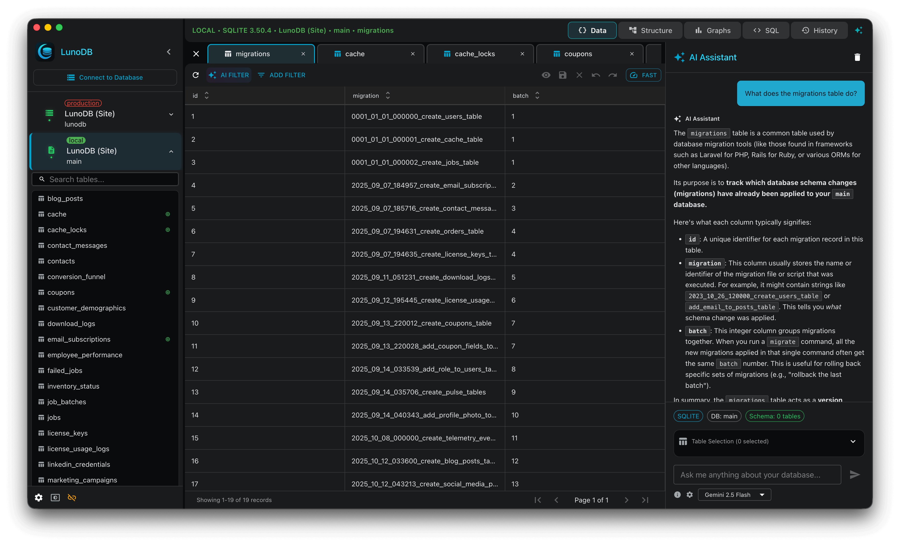
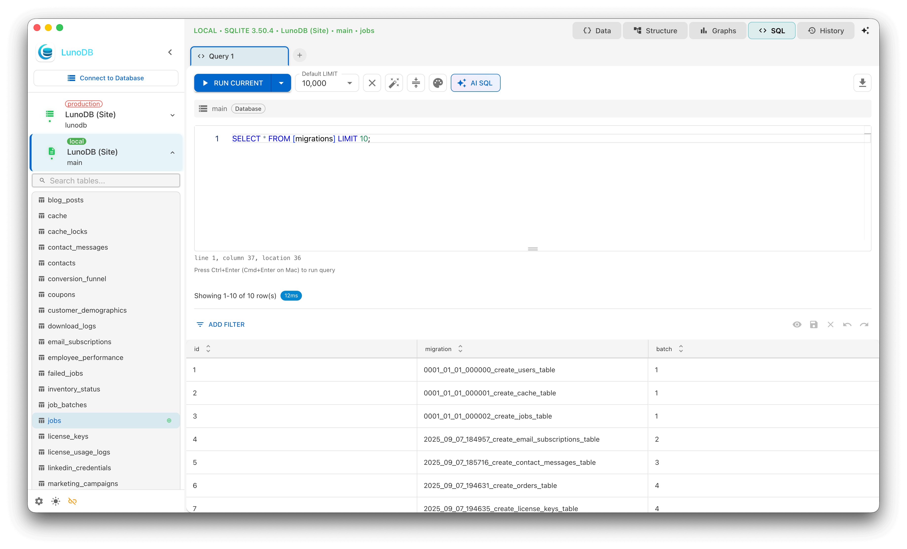

# LunoDB

LunoDB is a professional-grade, cross-platform database management client designed for developers and database administrators. Built with modern technologies, it provides comprehensive tools for managing multiple databases with an intuitive, native desktop experience.

**✨ NEW in v1.9.1:** Your filters and unsaved changes are now saved automatically, even when switching tables or restarting the app. Table tabs show clear indicators when you have unsaved edits.

## Download

[**Download Latest Release**](https://github.com/lunodb/lunodb/releases/latest)

- **macOS** - Apple Silicon & Intel
- **Windows** - x64 & ARM64
- **Linux** - Debian & RPM packages

## Supported Databases

🐬 **MySQL** - MySQL 5.7+, 8.0+
🦭 **MariaDB** - MariaDB 10.0+
🐘 **PostgreSQL** - PostgreSQL 10+
📄 **SQLite** - SQLite 3.x
🏢 **SQL Server** - SQL Server 2016+, Azure SQL
🍃 **MongoDB** - MongoDB 4.0+, Atlas
🔴 **Redis** - Redis 6.0+, Redis Cloud

## Features

### Core Features
- **Multi-Database Support** - Connect to MySQL, PostgreSQL, SQLite, MariaDB, MongoDB, SQL Server, and Redis
- **Professional Query Editor** - Monaco Editor with syntax highlighting, autocomplete, and multi-query support
- **Query Control** - Cancel long-running queries and get warnings before querying large tables
- **Copy & Paste Rows** - Duplicate data with keyboard shortcuts (⌘C/Ctrl+C and ⌘V/Ctrl+V)
- **Export Query Results** - Export query results in CSV, JSON, and SQL formats
- **Cancellable Imports** - Stop long-running imports with one click and minimize dialog to keep working
- **Intuitive Interface** - Beautiful dark/light themes with native platform integration
- **SSH Tunneling** - Secure connections with SSH key support
- **Data Import/Export** - CSV, JSON, SQL formats with Gzip compression
- **Real-Time Editing** - Inline cell editing with change tracking
- **Smart Persistence** - Connections, cursor position, and database selection automatically saved

### AI-Powered Features
- **Natural Language SQL** - Convert plain English to SQL queries
- **AI Chat Assistant** - Database-aware AI assistant
- **Smart Filtering** - Create complex filters using natural language
- **Multi-Provider Support** - OpenAI GPT-4/5, Anthropic Claude, Google Gemini
- **Schema-Aware** - AI understands your database structure

### Performance & Security
- **Virtual Scrolling** - Handle large datasets efficiently
- **Connection Pooling** - Smart connection management
- **SSL/TLS Support** - Encrypted database connections
- **Secure Storage** - Encrypted credential storage

## Screenshots

### Home Screen

### Query Editor - Light Theme

### Query Editor - Dark Theme

### AI Features

## System Requirements

| Platform | Minimum Version |
|----------|----------------|
| macOS | 10.15 (Catalina) or later |
| Windows | Windows 10 or later |
| Linux | Ubuntu 20.04+ / RHEL 8+ |

## Pricing

LunoDB is **free to use** with no time restrictions for personal and commercial use.

| Feature | Free | Pro ($39) |
|---------|------|-----------|
| Database Connections | Up to 2 | Unlimited |
| SSH Tunnels | ✓ | ✓ |
| AI Features | ✓ | ✓ |
| Query Editor | ✓ | ✓ |
| Import/Export | ✓ | ✓ |
| Priority Support | ✗ | ✓ |
| Commercial Use | ✓ | ✓ |

We encourage users who find LunoDB helpful to consider purchasing a Pro license to support ongoing development and help us build more features.

**[Purchase Pro License - $39](https://lunodb.app/pricing)**

## Documentation & Support

- **Documentation** - [GitHub Wiki](https://github.com/lunodb/lunodb/wiki)
- **Bug Reports** - [GitHub Issues](https://github.com/lunodb/lunodb/issues)
- **Feature Requests** - [GitHub Discussions](https://github.com/lunodb/lunodb/discussions)

## Contact

**Email:** support@lunodb.app
**Website:** https://lunodb.app
**Twitter:** [@lunodb_app](https://x.com/lunodb_app)

---

**© 2025 LunoDB** • Made with ❤️ for developers
