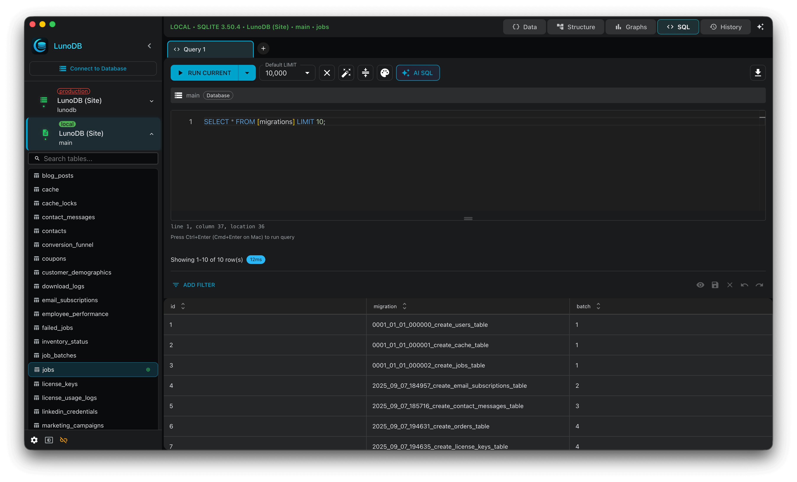

# LunoDB

LunoDB is a professional-grade, cross-platform database management client designed for developers and database administrators. Built with modern technologies, it provides comprehensive tools for managing multiple databases with an intuitive, native desktop experience.

**✨ NEW in v1.25.0:** The newest AI models (Claude Opus 4.6 and GPT-5.3 Codex), a better mobile export experience, and faster app updates.

**LunoDB Mobile is here!** - Manage your databases on the go. Available now on [iOS](https://apps.apple.com/us/app/lunodb/id6756377885), Android coming soon. [Learn more](#lunodb-mobile)

## Download

[**Download Latest Release**](https://github.com/lunodb/lunodb/releases/latest)

- **macOS** - Apple Silicon & Intel (fully automatic updates)
- **Windows** - x64 & ARM64 (fully automatic updates)
- **Linux**:
  - **AppImage** - Fully automatic updates (recommended)
  - **DEB Package** - Semi-automatic updates (requires password)
  - **RPM Package** - Manual updates via GitHub

## Auto-Updates

LunoDB includes built-in update notifications with varying levels of automation by platform:

- **macOS & Windows** - Fully automatic: downloads and installs updates seamlessly in the background
- **Linux AppImage** - Fully automatic: installs updates without requiring passwords or system permissions
- **Linux DEB** - Semi-automatic: downloads updates automatically, but requires your password to install (via system authentication)
- **Linux RPM** - Manual: notifies you of new versions and directs you to download from GitHub releases

All versions include in-app release notes and update notifications to keep you informed of new features and improvements.

## Supported Databases

🐬 **MySQL** - MySQL 5.7+, 8.0+
🦭 **MariaDB** - MariaDB 10.0+
🐘 **PostgreSQL** - PostgreSQL 10+
📄 **SQLite** - SQLite 3.x
🏢 **SQL Server** - SQL Server 2016+, Azure SQL
🍃 **MongoDB** - MongoDB 4.0+, Atlas
🔴 **Redis** - Redis 6.0+, Redis Cloud
🪶 **Turso** - LibSQL databases with full support

## Features

### Core Features
- **Multi-Database Support** - Connect to MySQL, PostgreSQL, SQLite, MariaDB, MongoDB, SQL Server, Redis, and Turso
- **Professional Query Editor** - Monaco Editor with syntax highlighting, autocomplete, and multi-query support
- **SQL History Viewer** - View your SQL queries in a popup window with syntax highlighting
- **Selected Row Counter** - See how many rows you've selected in real-time when working with large datasets
- **Query Log Panel** - Track every query with execution time, status, and error messages (Pro feature)
- **Keyboard Shortcuts** - Refresh tables and graphs with Cmd+R (Mac) or Ctrl+R (Windows/Linux)
- **Drag-and-Drop Connection Ordering** - Reorder saved connections by dragging, with order persisting across sessions
- **Transfer to Mobile** - QR code sync to instantly transfer connections and graphs to LunoDB Mobile
- **Persistent Settings** - Connection settings and keep-alive preferences save between sessions automatically
- **View Preference Memory** - App remembers if you prefer table view or grid view
- **Streaming Query Execution** - Real-time progress tracking shows queries executing live with accurate status updates
- **Last Executed Query Display** - Table views show the exact SQL query that was executed for full visibility
- **Table Analysis** - Identify opportunities for query optimization with the new table analysis feature
- **Query Control** - Cancel long-running queries and get warnings before querying large tables
- **Multi-Query Toggle** - Show or hide multi-query input as needed for cleaner workspace
- **Unsaved Changes Protection** - Get warned before switching tabs with unsaved SQL changes
- **Expandable Text Fields** - View large text content with one click in SQL and Table views
- **Copy & Paste Rows** - Duplicate data with keyboard shortcuts (⌘C/Ctrl+C and ⌘V/Ctrl+V) - Pro feature
- **Export Query Results** - Export query results in CSV, JSON, and SQL formats
- **Drag & Drop Imports** - Drop SQL files directly into the import dialog for instant imports
- **Smart Column Sizing** - Columns automatically resize to fit content perfectly
- **Minimizable Exports** - Minimize Export Database dialog to continue working while exports run in the background
- **Cancellable Imports** - Stop long-running imports with one click and minimize dialog to keep working
- **Markdown Release Notes** - Beautiful formatted release notes with code blocks, tables, and links
- **Intuitive Interface** - Beautiful dark/light themes with custom-styled scrollbars and native platform integration
- **Localized Numbers** - Numbers display in your local format with readable pagination (e.g., "1,000" vs "1000")
- **SSH Tunneling** - Secure connections with SSH key support
- **Data Import/Export** - CSV, JSON, SQL formats with Gzip compression
- **Timestamped Exports** - Export filenames include formatted timestamps for better file organization
- **Real-Time Editing** - Inline cell editing with change tracking
- **Smart Persistence** - Connections, cursor position, and database selection automatically saved
- **Enhanced MongoDB Support** - Proper Extended JSON date format and improved context menus

### AI-Powered Features
- **Natural Language SQL** - Convert plain English to SQL queries
- **AI Chat Assistant** - Database-aware AI assistant with persistent conversations
- **Smart Filtering** - Create complex filters using natural language
- **8 AI Providers** - OpenAI (GPT-5.3 Codex), Anthropic (Claude Opus 4.6), Google (Gemini), Grok, DeepSeek, OpenRouter, Ollama, Custom
- **Thinking & Effort Controls** - Configure reasoning depth for supported models
- **Schema-Aware** - AI understands your database structure

### Data Visualization
- **AI Graph Generation** - Let AI create charts based on your data with intelligent chart type suggestions
- **Custom SQL Charts** - Build visualizations using your own SQL queries
- **Multi-Query Graphs** - Combine data from multiple queries in one visualization
- **Multiple Chart Types** - 5 chart types: line, bar, area, pie, and scatter
- **Custom Color Schemes** - Personalize charts to match your style
- **Smart Date Formatting** - Automatic date handling in time-series visualizations
- **Graph Management** - Create, edit, duplicate, and delete graphs per connection
- **Backup & Restore** - Graphs saved with backups and restored together

### Workspace & Schema Visualization
- **Schema Relationship Diagrams** - Interactive visualization of tables and their foreign key relationships with improved spacing
- **Drag-and-Drop Layout** - Automatic layout with manual repositioning support and no overlapping elements
- **Export Diagrams** - Export schema diagrams as high-quality images for documentation
- **Multiple Workspaces** - Open multiple independent workspace windows for parallel workflows
- **Smart Session Restoration** - Each workspace remembers its connections and open tabs, restoring them correctly on startup
- **Isolated State** - Work on dev, staging, and production databases side-by-side with no interference
- **Audio Feedback** - Subtle sound effects for connections and query execution (can be disabled)
- **Platform-Aware Shortcuts** - Keyboard shortcuts automatically use ⌘ on macOS, Ctrl on Windows/Linux

### Performance & Security
- **SSL/TLS Support** - Encrypted database connections
- **Secure Storage** - Encrypted credential storage

## Screenshots

### Home Screen

### Query Editor - Light Theme

### Query Editor - Dark Theme

### AI Features

## System Requirements

| Platform | Minimum Version |
|----------|----------------|
| macOS | 10.15 (Catalina) or later |
| Windows | Windows 10 or later |
| Linux | Ubuntu 20.04+ / RHEL 8+ |

## Pricing

LunoDB is **free to use** with no time restrictions for personal and commercial use.

**🎁 14-Day Pro Trial** - Try all Pro features free for 14 days with a simple email signup. No credit card required.

### Subscription Plans

| Plan | Monthly | Annual | Savings |
|------|---------|--------|---------|
| **Pro License** (1 device) | $5.99/month | $39/year | 46% |
| **Pro Bundle** (up to 3 devices) | $9.99/month | $59/year | 51% |

### Feature Comparison

| Feature | Free | Pro |
|---------|------|-----|
| Database Connections | Up to 2 | Unlimited |
| Monaco Editor | ✗ | ✓ |
| Export (CSV, JSON, SQL) | ✗ | ✓ |
| SQL History | Limited | Unlimited |
| Graphs & Visualizations | ✗ | ✓ |
| AI Features | ✗ | ✓ |
| SSH Tunnels | ✗ | ✓ |
| SSL/TLS Connections | ✗ | ✓ |
| Query Editor | ✓ | ✓ |
| Priority Support | ✗ | ✓ |
| Commercial Use | ✓ | ✓ |

We encourage users who find LunoDB helpful to consider subscribing to Pro to support ongoing development and help us build more features.

**[Subscribe to Pro](https://lunodb.app/subscribe)**

## LunoDB Mobile

Take your database management on the go with LunoDB Mobile. **Available now on iOS, completely free.**

Android support is coming soon.

### Features
- **5 Database Types** - MySQL, PostgreSQL, MariaDB, SQLite, and Turso
- **Direct Connections** - Turso connects directly via HTTPS, SQLite works locally - no proxy needed
- **SQLite File Import** - Import existing .db, .sqlite, and .sqlite3 files from your device or cloud storage
- **QR Code Sync** - Instantly transfer all connections, graphs, and SSH tunnels from LunoDB Desktop
- **Query Editor** - Write and execute queries with mobile-optimized interface
- **AI Assistant** - Natural language SQL generation with your own API keys
- **Visualizations** - Charts, graphs, and ER diagrams on the go
- **Secure Connections** - MySQL, PostgreSQL, and MariaDB connect via LunoDB Cloud proxy
- **Biometric Security** - Face ID and fingerprint lock for your connections

### Connection Types

| Database | Connection Method |
|----------|------------------|
| MySQL, PostgreSQL, MariaDB | Via LunoDB Cloud (secure proxy) |
| Turso | Direct HTTPS (no proxy) |
| SQLite | Local files on device |

Learn more on our [website](https://lunodb.app/mobile) or follow us on [X](https://x.com/lunodb_app) for updates.

## Documentation & Support

- **Documentation** - [GitHub Wiki](https://github.com/lunodb/lunodb/wiki)
- **Bug Reports** - [GitHub Issues](https://github.com/lunodb/lunodb/issues)
- **Feature Requests** - [GitHub Discussions](https://github.com/lunodb/lunodb/discussions)

## Contact

**Email:** support@lunodb.app
**Website:** https://lunodb.app
**X:** [@lunodb_app](https://x.com/lunodb_app)
**LinkedIn:** [LunoDB](https://www.linkedin.com/company/lunodb)

---

**© 2025-2026 LunoDB** • Made with ❤️ for developers
